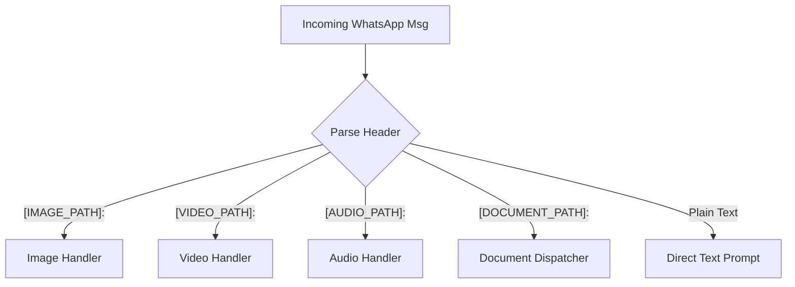

# Plan: Handling Rich Media on API Side (process_message)

This plan details how the Python API can parse, categorize, and structure incoming WhatsApp messages containing text, images, videos, audio, documents, and archives, and format them for a multimodal LLM.

## 1. Message Classification & Parsing Flow

When the WhatsApp client receives a message, it writes the file locally and sends a structured path header to the API. In `process_message`, we parse this string using regular expressions or headers to classify the media type:



---

## 2. Handling & Formatting by Media Category

### A. Images (Standard Image & Document Images)
- **Supported Formats**: `.jpg`, `.jpeg`, `.png`, `.webp`
- **Processing**:
  1. Read the file path from the header.
  2. Encode the image into a Base64 string.
- **LLM Integration**:
  - Pass it natively as an `image_url` block in the message content payload (standard for OpenAI, Claude, and Gemini API schemas).

---

### B. Audio (Voice Notes & Audio Files)
- **Supported Formats**: `.mp3`, `.ogg`, `.wav`, `.m4a`
- **Processing Options**:
  1. **Option 1 (Transcription - Recommended for text-only LLMs)**: Send the audio file to a transcription model (e.g. Whisper API) to convert speech into text.
  2. **Option 2 (Native Audio Input - Supported by Gemini / GPT-4o Audio)**: Pass the raw audio bytes or upload via file API to be processed natively by the LLM.
- **LLM Integration**:
  - For Option 1: Append the transcription to the user prompt: `[Voice Transcript]: {transcript}`.
  - For Option 2: Pass as a native audio content part in the LLM payload.

---

### C. Videos (Video Messages & Document Videos)
- **Supported Formats**: `.mp4`, `.mov`, `.avi`, `.mkv`
- **Processing Options**:
  1. **Option 1 (Frame Extraction - High Compatibility)**: Use a library like `opencv-python` to extract frames from the video at a rate of 1 frame per second (fps). Downscale the frames to save tokens.
  2. **Option 2 (Native Video Upload - Recommended for Gemini)**: Use the cloud provider's File API to upload the video directly.
- **LLM Integration**:
  - For Option 1: Append the series of extracted frames as a sequence of image blocks in the LLM content list, along with a prompt warning the LLM that this is a video sequence.
  - For Option 2: Reference the uploaded video file metadata object in the prompt.

---

### D. Text-based Documents
- **Supported Formats**: `.txt`, `.csv`, `.json`, `.md`
- **Processing**:
  1. Read the raw text directly from the file.
- **LLM Integration**:
  - Inject the text directly into the prompt wrapped in descriptive XML-like tags, which LLMs parse extremely well:
    ```
    Here is the content of the attached document:
    <document name="data.csv">
    {extracted_text_content}
    </document>
    ```

---

### E. Office Documents
- **Supported Formats**: `.pdf`, `.docx` (Word), `.xlsx` (Excel), `.pptx` (PowerPoint)
- **Processing**:
  - **PDFs**: Use `pypdf` or `pdfplumber` to extract text. If the PDF contains scanned images or heavy formatting, convert pages to images (using `pdf2image`) and treat them as multi-page image inputs.
  - **Word**: Use `python-docx` to extract structured paragraphs and headings.
  - **Excel**: Use `pandas` to load worksheets and convert them into clean Markdown tables (via `df.to_markdown()`), which LLMs interpret far better than raw CSV.
  - **PowerPoint**: Use `python-pptx` to parse text slide-by-slide.
- **LLM Integration**:
  - Format the extracted text/tables clearly under `<document>` XML tags in the prompt.

---

### F. Archives
- **Supported Formats**: `.zip`, `.tar.gz`
- **Processing**:
  1. Extract the archive into a temporary folder.
  2. Index all files inside the archive (file tree structure).
  3. Filter and parse the most important files (e.g. text/code files) while ignoring binary assets.
- **LLM Integration**:
  - Provide the file tree diagram and append key file contents to the user prompt.

---

## 3. Recommended General Python Libraries for implementation

- **Base Utilities**: `os`, `re`, `base64`, `shutil`
- **Video & Audio**: `opencv-python` (frames), `openai-whisper` (or Whisper API client)
- **PDF & Office**: `pypdf`, `python-docx`, `pandas`, `python-pptx`
- **Tables**: `tabulate` (converts pandas dataframes to nice markdown tables)
- **Zips**: `zipfile` (built-in Python library)
